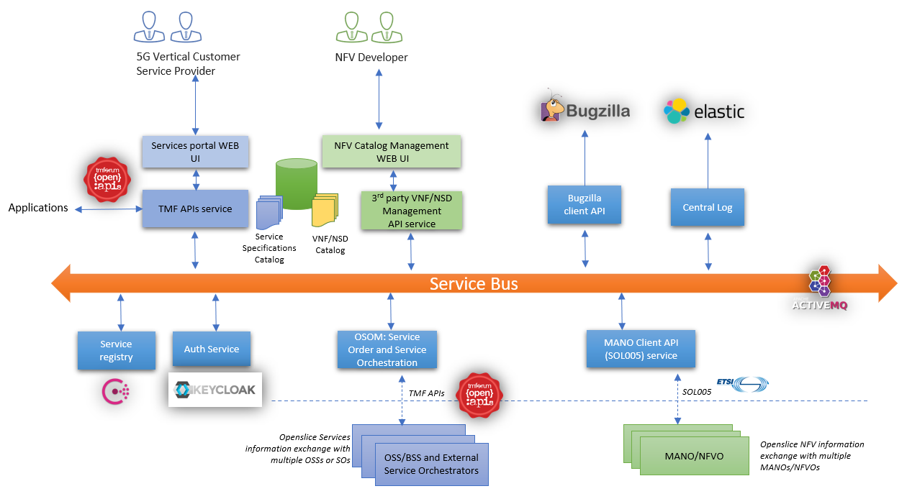
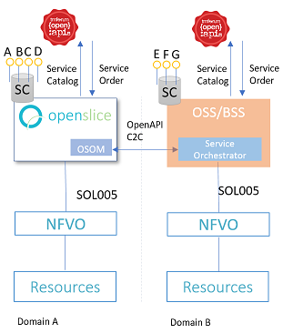

# Architecture

Openslice offers the following main functionalities:

* Service Catalog Management: A CSP will have the ability to manage the Service Catalog Items, their attributes , organize in categories and decide what to make available to Customers
* Services Specifications: A CSP will be able to manage Service Specifications
* Service Catalog Exposure: A CSP will be able to expose catalog to customers and related parties
* Service Catalog to Service Catalog: Openslice able to consume and provide Service Catalog items to other catalogs
* Service Order: The Customer will be able to place a Service Order
* Service Inventory: The Customer and Provider will be able to view deployed Services status

The following figure displays the overall architecture of Openslice.

Openslice allows Vertical Customers browsing the available offered service specifications. It consists of:

* Web frontend UIs that consist of mainly two portals: i) a NFV portal allowing users self-service management and onboarding VNFDs/NSDs to facility’s NFVO ii) a Services Portal, which allows users to browse the Service Catalog, Service Blueprints specifications and the Service Inventory
* An API gateway that proxies the internal APIs and used by the web front end as well as any other 3rd party service
* A Message Bus where all microservices use it to exchange messages either via message queues or via publish/subscribe topics
* An authentication server implementing Oauth2 authentication scheme
* A microservice offering TMF compliant API services (eg Service Catalog API, Service Ordering APIetc)
* A microservice offering NFV API services (eg VNF/NSD onboarding etc) and allows to store VNFDs and NSDs in a catalog
* A microservice that is capable to interface to an issue management system. For example it raises an issue to all related stakeholders (CSP, NOP, CSC) that a new Service Order is requested
* Central logging microservice that is capable to log all distributed actions in to an Elasticsearch cluster
* A Service Orchestrator solution that will propagate Service Ordering requests to the equivalent SOs and NFVOs 

## Deploying Openslice in multi domain scenarios

A typical deployment across domains, involves today some typical components: i) an OSS/BSS to allow customers access the service catalog and perform service orders, ii) a Service Orchestrator (SO) component for executing the service order workflow, as well as iii) a Network Functions Virtualization Orchestrator (NFVO) for configuring the iv) network resources.

TMF Open APIs are introduced not only for exposing catalogues and accepting service orders, but also implementing the East-West interfaces between the domains, fulfilling also the LSO requirements as introduced by MEF discussed in Section II.

The following figure shows how openslice could be used in such scenarios:

