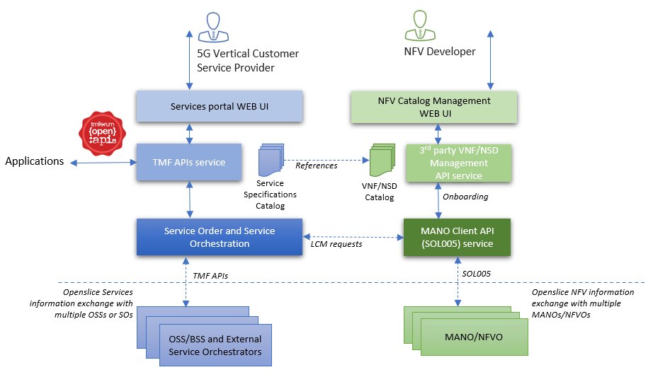
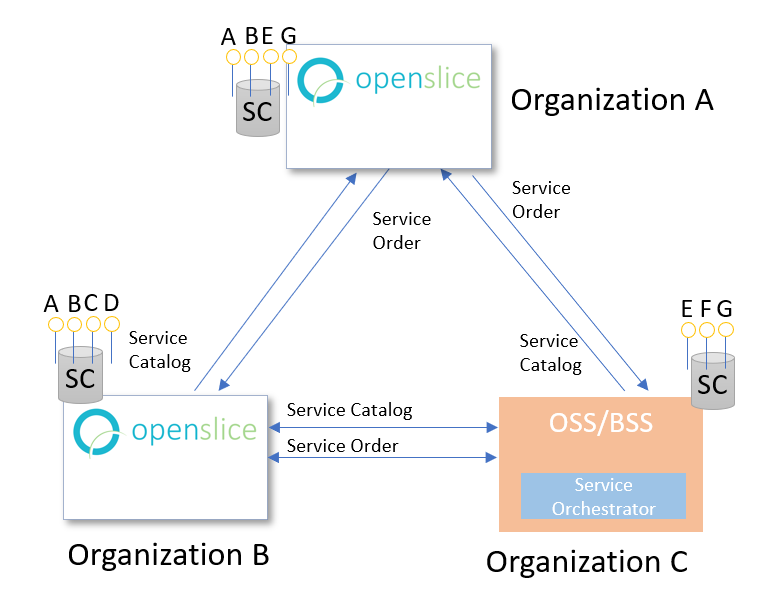

version: 2020-Q2 1.0.2-SNAPSHOT

Openslice is a prototype open source, operations support system. It supports VNF/NSD onboarding to OpenSourceMANO (OSM) and NSD deployment management. It also supports TMFORUM OpenAPIs regarding Service Catalog Management, Ordering, Resource, etc.

## Latest news

* 17/2/2020 Openslice will participate in the next ETSI NFV&MEC Plugtests 2020, at Sophia Antipolis, France  15-19 June 2020 as a supporting open source communities . Read more at: <https://www.etsi.org/events/upcoming-events/1683-nfv-mec-plugtests#pane-1/> 

## Usage

Openslice allows Vertical Customers to browse the available offered service specifications and also allows NFV developers to onboard and manage VNF and Network Service artifacts. 
The following figure displays the usage of Openslice.

There are two portals offering UI friendly access to users:

* The Services portal allows users to access services and service providers to design services. 
* The NFV portal allows users to self-manage NFV artifacts and onboard them to a target MANO/NFV Orchestrator.

3rd party applications can use Openslice through TMForum Open APIs.

Service Specifications reside into Service Catalogs, grouped in Categories. Openslice offers a Service Orchestrator called [OSOM](./architecture/osom.md). OSOM instantiates Service Specifications by requesting Network Services from target MANOs/NFVOs. NFV artifacts reside into a VNF/NSD catalog and are onboarded to a target MANO/NFV Orchestrator. Service Specifications reference NSD from the VNF/NSD catalog. 

Customers make Service Orders and Openslice instantiates the requested Service Specifications of the Service Order. Running Services instantiated by Openslice, reside in Openslice Service Inventory. The following picture displays how Service Specifications are related to Running Services and how Running Services relate with instantiated running Network Services

## Multidomain scenarios and federation

Openslice can be used to exchange service specifications/catalogs and make service orders between Organizations as the following figure displays.

An Identity federation is also possible since our authentication service is based on Keycloak (see [OAuth](./architecture/oauth.md) )

See more on [Consuming Services From External Partner Organizations](./architecture/consumingServicesFromExternalPartners.md)

## Live Demo

* Openslice demo: <http://portal.openslice.io/>
* Openslice Service Catalogs and ordering: <http://portal.openslice.io/services/>
* Openslice NFV Services onboarding: <http://portal.openslice.io/nfvportal>
> username=admin, password=openslice   or  username=admin, password=changeme

## Video demo

* <https://youtu.be/KU8JPDFFl9A>

---

## Installing

See [Deployment](./deployment.md)

---

## Hardware requirements

The complete environment consists of  microservices deployed as docker containers. Portainer is also installed to monitor them at port 9000

If you would like to operate all APIs, OSOM, the Mysql Server, nginx, etc then you need at least:

- 4 cores
- 8GB RAM
- 20GB HD space

(NOTE: Bugzilla or ELK are not included and we assume they run elsewhere)

However you can try with a minimum installation on a VM on a laptop with:

- 2 cores
- 4GB of RAM  

 

## Supported APIs

For a quick access check our swagger links:

* TMF APIs: <http://portal.openslice.io/tmf-api/swagger-ui.html>
* API for VNF/NSD management: <http://portal.openslice.io/osapi/swagger-ui.html>

## Source code

Get source code here: <https://github.com/openslice>

## Contributing

[Contributing](./contributing/developing.md)

## Social Media

* Twitter: <https://twitter.com/OpensliceOSS>
* Slack: https://openslice.slack.com

## History

* The NFV portal part of Openslice was initially developed in H2020 European project 5GinFIRE (https://5ginfire.eu)  by University of Patras, Greece
* Openslice services, APIs and current version are actively maintained by University of Patras, Greece in H2020 European project 5G-VINNI (https://5g-vinni.eu/)

